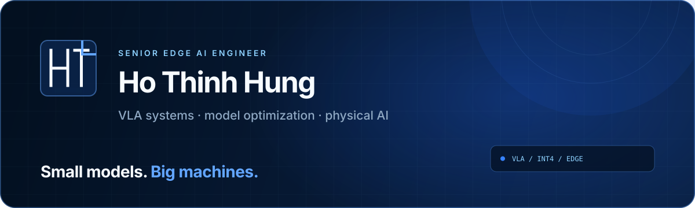

**Research portfolio: [Hung Thinh Ho — Embodied AI & Robot Learning](https://hungho77.github.io/hungho77/)**

<div align="center">
  <a href="https://hungho77.github.io/hung/">
    
  </a>
</div>

<div align="center">
  <a href="https://hungho77.github.io/hung/"></a>
  <a href="https://hungho77.github.io/hung/blog/"></a>
  <a href="https://www.linkedin.com/in/hunho77"></a>
</div>

<br />

I am **Ho Thinh Hung**, a Senior Edge AI Engineer working where multimodal models meet physical machines. I optimize Vision-Language-Action and Edge LLM systems, build compact VLA models, and turn research ideas into measurable deployment trade-offs.

```text
model quality  ×  memory  ×  latency  ×  power  →  useful intelligence at the edge
```

### What I am building

- **Small VLA models** for responsive, resource-constrained robotic systems.
- **Inference optimization** across BF16, FP8, NVFP4, INT8, and INT4/AWQ.
- **Edge deployment paths** using TensorRT, TensorRT Edge-LLM, ONNX, CUDA, and Jetson.
- **Reproducible benchmarks** that expose the real memory, latency, throughput, and accuracy trade-offs.
- **Learning in public** through experiment reports, paper notes, and practical implementation guides.

### Engineering proof points

| Signal | What it represents |
| :--- | :--- |
| **100K+ model downloads** | Quantized models adopted through a company Hugging Face organization. |
| **TensorRT Edge-LLM investigations** | Isolated numerical and export failures with controlled layer-by-layer experiments. |
| **NVIDIA maintainer confirmation** | Findings and fix direction acknowledged in the upstream repository. |
| **Production AI systems** | Experience spanning GPU inference, real-time multimodal pipelines, and robotics. |

> Read the full experiment: **[TensorRT Edge-LLM — four fixes from controlled experiments](https://hungho77.github.io/hung/blog/debugging-tensorrt-edge-llm/)**<br />
> Upstream evidence: **[issue #151](https://github.com/NVIDIA/TensorRT-Edge-LLM/issues/151)** · **[issue #105](https://github.com/NVIDIA/TensorRT-Edge-LLM/issues/105#issuecomment-5235852406)**

### Selected work

| Project | Focus |
| :--- | :--- |
| **[Model Quantization Recipes](https://github.com/hungho77/model-quantization-recipes)** | Practical ModelOpt recipes and benchmark comparisons for BF16, FP8, NVFP4, INT8 SmoothQuant, and INT4 AWQ. |
| **[TensorRT Edge-LLM](https://github.com/hungho77/TensorRT-Edge-LLM)** | Working fork used to reproduce, isolate, and validate edge LLM/VLM inference failures. |
| **[Research Note Agent](https://github.com/hungho77/research-note-agent)** | A workflow for reading papers and publishing engineering-focused, implementation-ready notes. |
| **[Portfolio & Learning in Public](https://github.com/hungho77/hung)** | Interactive benchmarks, project stories, and long-form notes about VLA and model optimization. |

### Technical toolkit

<div align="center">


</div>

<details>
<summary><strong>More about the systems I work on</strong></summary>
<br />

- **VLA & multimodal:** vision encoders, language backbones, action heads, policy inference, asynchronous execution.
- **Optimization:** quantization, mixed precision, calibration, KV-cache and activation memory, kernel/runtime profiling.
- **Serving:** vLLM, Triton Inference Server, streaming APIs, multi-GPU inference, latency and throughput analysis.
- **Perception:** DeepStream, YOLO, tracking, face recognition, OCR, and real-time video analytics.
- **Systems:** CUDA, WebRTC, Kafka, Redis, Docker, REST, WebSocket, and production observability.

</details>

---

<div align="center">
  <strong>Small models. Big machines.</strong><br />
  <sub>I care about the numbers between a paper result and a reliable deployed system.</sub>
</div>
